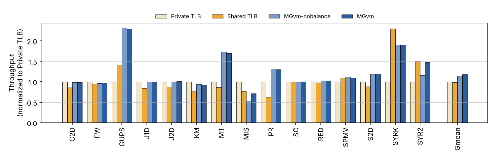
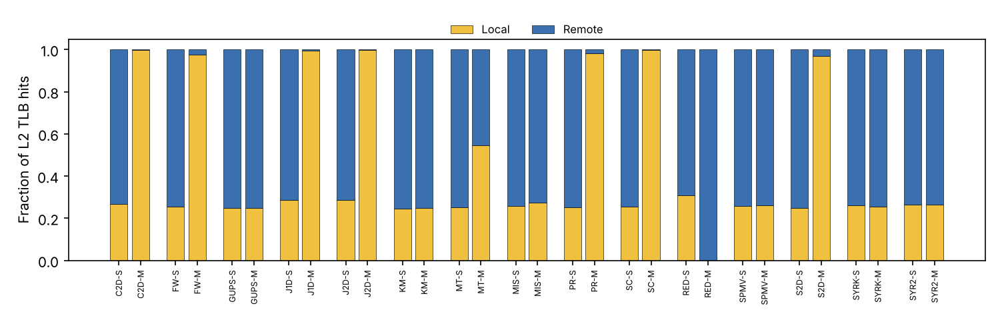
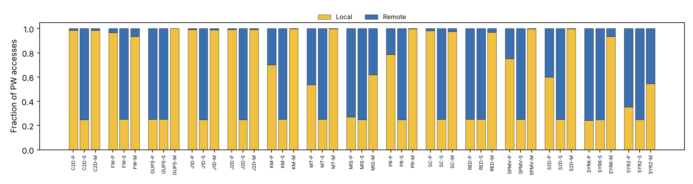
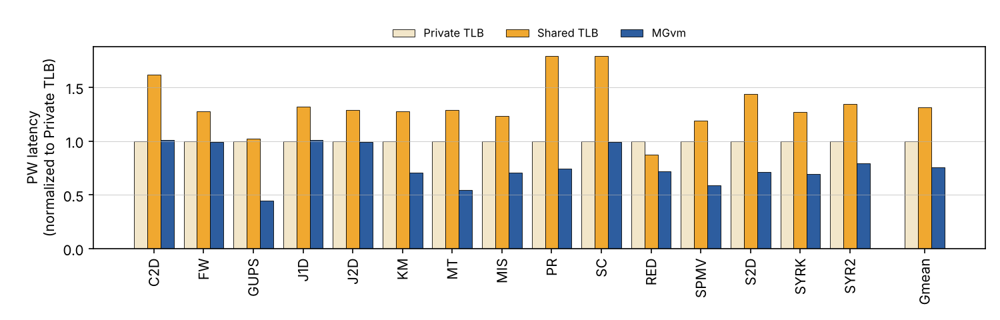

# MGvm: Virtual Memory System of MCM GPUs — artifact and results

This repository holds the artifact of

> Pratheek B, Neha Jawalkar, Arkaprava Basu. **Designing Virtual Memory System
> of MCM GPUs.** MICRO 2022. Artifact: [10.5281/zenodo.6937470](https://doi.org/10.5281/zenodo.6937470)

together with fixes that make the evaluation scripts run on an ordinary
workstation, a scaled-down input preset, a plotting script, and the results of
running all 60 simulations (15 workloads x 4 configurations) with that preset.

The first commit on `main` is the unmodified content of the Zenodo archive
(minus three stray executables and Python caches); every later change is a
separate commit.

## Layout

| Path | Content |
|------|---------|
| `mgpusim/`, `akita/`, `mem/`, `noc/`, `util/`, `dnn/`, `vis/` | The authors' modified MGPUSim and its Akita modules (Go). The MCM GPU, private/shared L2 TLBs, RTUs, page walkers, LASP scheduling/placement, dHSL and the balancing logic live here. |
| `scripts/` | The artifact's workflow scripts `0_`–`6_`, plus `4_run_all.sh` and `7_plot_figures.py` |
| `results/small/` | Results of the `small` preset: `results.csv`, `normalized.csv`, `figures/`, the raw `metrics.csv` of every run (gzipped), and the run log |
| `mgvm.Dockerfile` | Original artifact Dockerfile (expects `mgvm.tar.gz` from Zenodo) |
| `Dockerfile` | Builds the same environment from this repository |

The branch `reimplementation-mgpusim-v3` contains an independent
reimplementation of MGvm on MGPUSim v3 that was written from the paper before
the artifact was available. It is not used for the results below.

## Configurations

| Name | Meaning (paper) | Simulator flags |
|------|-----------------|-----------------|
| `private` | Private L2 TLB per chiplet | `-platform-type privatetlb` + LASP placement |
| `shared` | Shared L2 TLB, 4KB-interleaved slices | `-platform-type xortlb -l2-tlb-striping 1` + LASP |
| `mgvm-nobalance` | dHSL + dHSL-coarse + PTE placement | `-platform-type customtlb -use-lasp-hsl-mem-alloc -custom-hsl N` |
| `mgvm` | MGvm with dHSL-balance | as above + `-switch-tlb-striping` |

All use LASP CTA scheduling. The GPU has 4 chiplets with 32 CUs each, a 512-entry L2 TLB slice and 16 page walkers per chiplet, and a 32ns inter-chiplet latency (Table I).

## Running

Requirements: Go (tested with 1.22 and 1.24), Python 3 with matplotlib.

```bash
cd scripts
./0_clean.sh
./1_compile_benchmarks.py          # builds the 15 sample binaries
./2_copy_benchmarks.sh             # private/ shared/ mgvm/ mgvm-nobalance/
./3_gen_runners.py --preset small  # or --preset paper (the default)
MGVM_JOBS=3 nohup ./4_run_all.sh > run_all.log 2>&1 &
# ... wait for all 60 runs ...
./5_collect_stats.py private shared mgvm-nobalance mgvm   # -> results.csv
./6_normalize_results.py results.csv normalized.csv
./7_plot_figures.py normalized.csv figures
```

`4_run_all.sh` skips runs that already produced `metrics.csv`, so it can be
re-run after a failure. The original per-configuration scripts
(`4_run_benchmarks_<config>.sh`) still work but start 15 simulations at once.

### With Docker

Both ways below were tested. Your user must be allowed to run Docker (be in
the `docker` group, or use `sudo docker`).

**A. Exactly as in the paper's appendix**, with the two files from the Zenodo
archive (`mgvm.Dockerfile` and `mgvm.tar.gz`) in one folder. This uses the
original, unmodified scripts, which only have the paper inputs.

```bash
unzip 6937470.zip                      # gives mgvm.Dockerfile and mgvm.tar.gz
docker build -f mgvm.Dockerfile . -t mgvm
docker run -dit --name mgvm mgvm       # detached, as the appendix recommends
docker exec -it mgvm bash
cd mgvm/scripts
./0_clean.sh; ./1_compile_benchmarks.py; ./2_copy_benchmarks.sh; ./3_gen_runners.py
./4_run_benchmarks_private.sh          # and _shared, _mgvm-nobalance, _mgvm
```

**B. From this repository** (includes the fixes, `--preset small`,
`4_run_all.sh` and the plotting script):

```bash
git clone https://github.com/Prayag-Mohanty/MGVm-GPU.git && cd MGVm-GPU
docker build -t mgvm-repo .
docker run -dit --name mgvm-repo mgvm-repo
docker exec -it mgvm-repo bash         # starts in /root/mgvm/scripts
./0_clean.sh && ./1_compile_benchmarks.py && ./2_copy_benchmarks.sh
./3_gen_runners.py --preset small
MGVM_JOBS=4 nohup ./4_run_all.sh > run_all.log 2>&1 &
```

The simulations keep running when you leave with `exit`, because the
container runs detached. Copy results out with
`docker cp mgvm-repo:/root/mgvm/scripts/figures .` (and the same for
`results.csv`, `normalized.csv`). If `docker build` fails with
`429 Too Many Requests`, Docker Hub is rate-limiting your network: run
`docker login` or wait and retry.

### Presets

- `paper`: the inputs used in the paper (C2D 8192x8192, J1D 64M elements, ...).
  The artifact appendix states 300–400GB of RAM per configuration and
  12–24 hours per run.
- `small`: the largest allocation is 8–16MB for most workloads. That is at or
  above the 8MB aggregate L2 TLB reach and well above the 2MB reach of one
  slice. SPMV, SYRK and SYR2K were shrunk further to fit in memory. The MGvm HSL
  (`-custom-hsl`, in pages) and the HSL-aware allocator (`hslaware-N`) are
  scaled with the largest allocation the same way as for the paper inputs. SYRK
  and SYR2K are capped at 3M and 10M instructions (the paper caps them at
  10M/30M). On a 4-core, 16GB machine all 60 runs took about 11 hours with
  `MGVM_JOBS=3` for the first pass and 2 for the memory-heavy reruns. Each
  run needs up to about 6GB with `-report-all`.

## Results (`small` preset)

Geometric means over the 15 workloads (paper values in parentheses):

| | vs. private TLB | vs. shared TLB |
|---|---|---|
| MGvm throughput | **1.18x** (1.52x) | **1.19x** (1.30x) |
| MGvm-nobalance throughput | 1.14x | |
| Shared TLB throughput | 0.99x | |
| MGvm vs. the better of private/shared per workload | **1.06x** (1.12x) | |
| Page-walk latency, shared / MGvm | 1.31x / 0.75x | |






What carries over from the paper at the small scale:

- **L2 TLB MPKI (Table III).** Many workloads match the paper closely under
  private TLB: C2D 1.07 (1.07), GUPS 699 (698), J1D 3.21 (3.21), J2D 2.16
  (2.16), MT 69.3 (69.3), SC 0.41 (0.40), RED 5.63 (6.01). FW is lower
  (1.16 vs 2.28) because its input is 4x smaller.
  The shared TLB cuts MPKI for SYRK (52.5 → 0.45) and SYR2 (22.4 → 0.08), and
  MGvm keeps those gains.
- **Fig. 8.** The shared TLB serves about 25% of L2 TLB hits locally (1 of 4
  chiplets). MGvm raises this to 97–100% for C2D, FW, J1D, J2D, PR, SC and S2D.
- **Fig. 9.** With MGvm almost all page-walk memory accesses are local, except
  for MIS and SYR2. Those two switch to dHSL-balance (fine-grain 4KB mapping),
  which gives up local PTE accesses to fix the L2 TLB imbalance, as described
  in Section VI-B.
- **Fig. 10.** The shared TLB lengthens page walks (1.31x); MGvm shortens them
  (0.75x).
- **Balancing.** MGvm is faster than MGvm-nobalance for MIS (+33%) and SYR2
  (+29%), the workloads the paper names as needing dHSL-balance.

Differences from the paper are expected with inputs 4–64x smaller. TLB
pressure is lower: C2D, J1D, J2D and SC see no throughput change across
configurations because translation is not on their critical path at this
size. So the average speedups are smaller than in the paper. MIS is slower
under MGvm than under private TLB at this scale.

### Fixes to the original scripts

- `6_normalize_results.py` wrote two separator columns before the L2 TLB hit
  group and before the page-walk group, but its header has one. Every column
  from "L2 TLB Local Hits" onward was therefore labelled one or two columns
  off. Throughput and page-walk latency were not affected.

## License

MGPUSim and the Akita modules are MIT-licensed (see the `LICENSE` files in
each module). The artifact is redistributed from Zenodo record 6937470.
